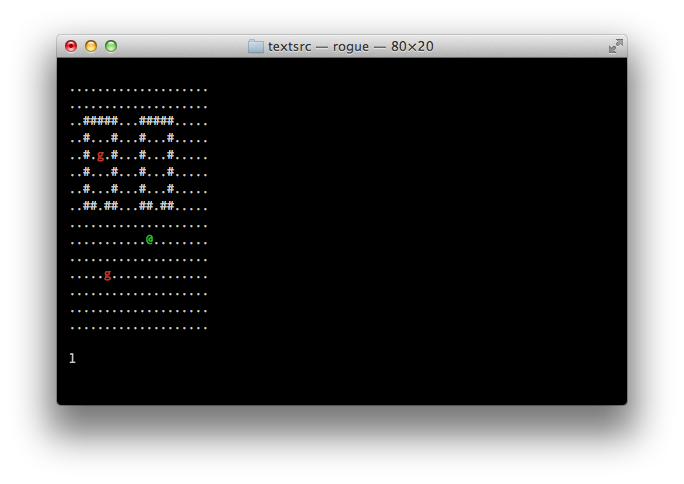
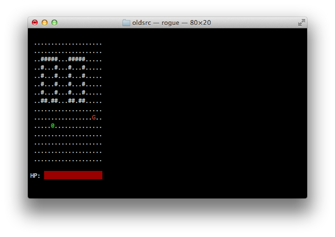
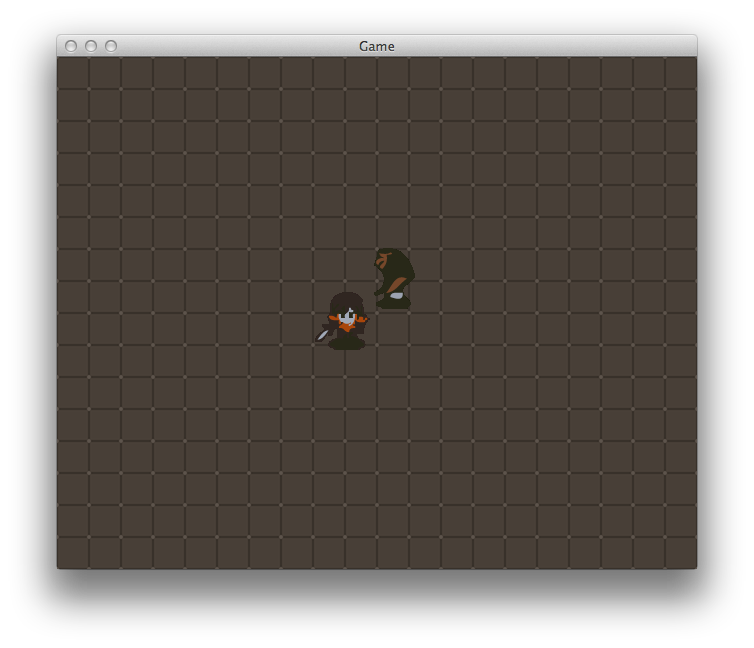

Another Roguelike!
================

### But not really!

A long, long time ago, when I first started this project, I figured I'd make a
Roguelike. I knew I'd have to start simple. There's no way you jump straight
into the deep end with this kind of thing. Especially since I know I'm not a
'rockstar' programmer, keeping everything simple meant I had a better chance of
actually completing the game. 

I was familiar with Nethack, so I went down that route.

The game was started from a terminal and played from a terminal. Learning the
Curses library was cool. I enjoyed making the terminal become a bunch of colors. 

The game had a bunch of cool stuff: There were goblins and dragons. There was a
win state and a lose state and it was fairly sophisticated, coding wise, I
thought.

I'd never coded a game before then. It was fun and cool and I was enjoying
myself.

But then I showed it to someone and they said "Why don't you have graphics?" The
answer I had was "I don't know how to do that." That's not a good answer.

So, I've been using the SDL library to do graphics, which is a lot more
different than Curses. (I wanted to use OpenGL, but I simply couldn't get the
library compiled or in a working fashion except for really basic stuff: drawing
a triangle on the screen.)

Graphics means I have to focus on a smaller things, like animations, collisions,
etc. It makes things a lot more complicated. My game hasn't 'caught up' to where
it was when it was terminal based. But it will get there soon. Probably sooner
than I think.

### How do I play it?

There really isn't much to do in the game at the moment, but if you really want
to try it, you are going to need the SDL library on your machine.

I am building this on Mac OSX 10.7.2 with GCC 4.2.1. 

Use the Makefile provided and the editor of your choice. I haven't tried
compiling this on Windows and I doubt it would work there at all.

If you can't figure out how to do all of that, wait until it is finished!
